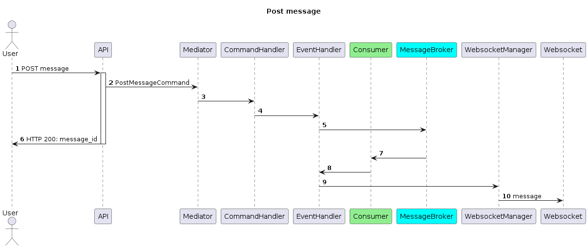
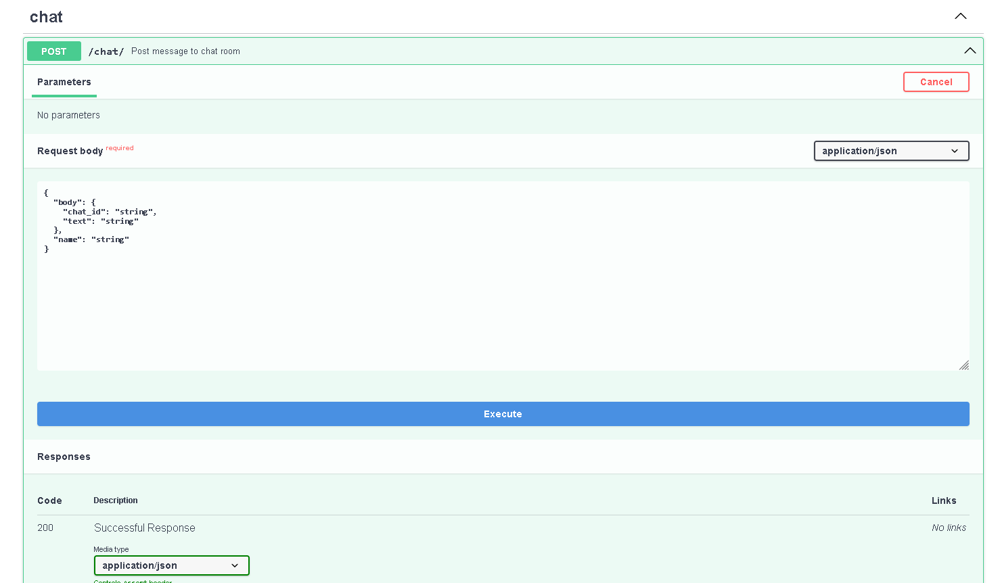
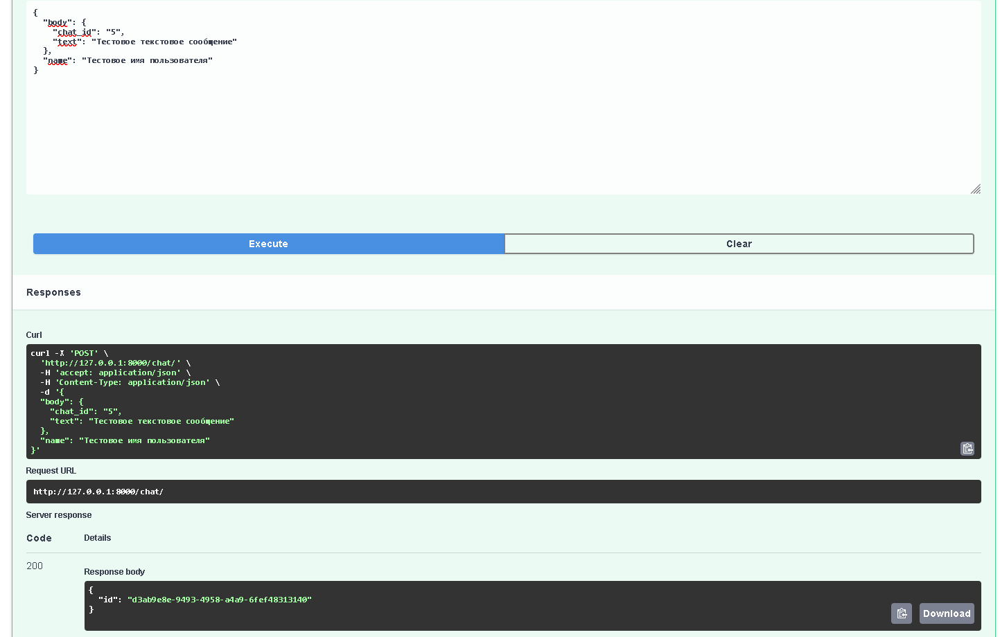
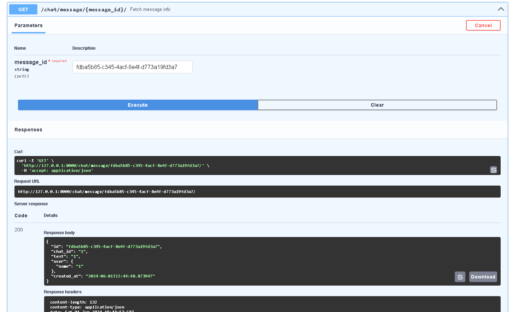
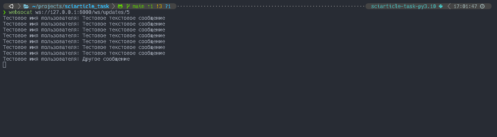
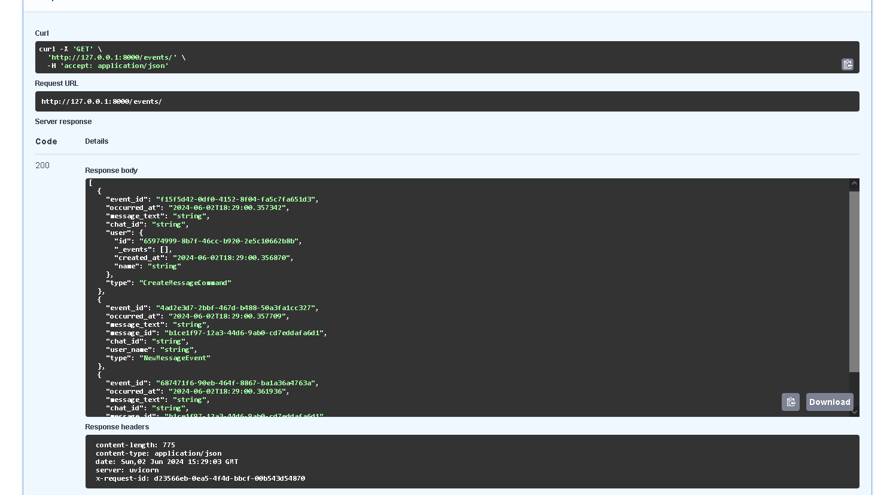
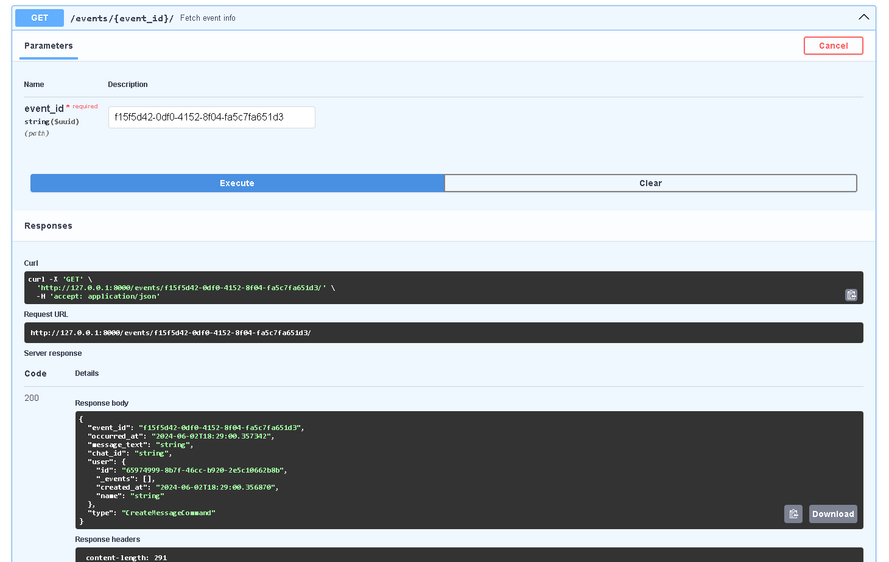

# FastAPI + FastStream + RabbitMQ чат

Чат на вебсокетах и событийной системе

# Настройка и запуск

## Настройка

Перед работой приложения нужно настроить переменные окружения.

- Для локального запуска(приложение локально, rabbit в докере) - нужно:
  1. Скопировать `local.env` в `sciarticle_task/.env`
  2. `poetry install` - установить проект
  3. `poetry shell` - активировать виртуальное окружение
- Для запуска в докере - скопировать `docker.env` в `docker-compose/.env`

## Запуск

1. Запустить rabbit через докер. `make storages`
2. Запустить приложение
   1. Докер - `make app`
   2. Локально - `make app-local`
3. Закрыть приложение `make down-all`

# Эксплуатация и проверка работоспособности

При выполнении инструкций, следующие утверждения должны быть правдивы:

- Swagger находится на `http://127.0.0.1:8000/api/openapi`.
- Подключиться к websocket можно из консоли, используя утилиту `websocat`: `websocat ws://127.0.0.1:8000/ws/updates/<Номер комнаты:int>`

# Архитектура

## Event-driven

Приложение построено на событийной системе, использующий паттерн "Посредник"(Mediator)

Ключевые составляющие Mediator:
1. `Command`, `CommandHandler` - команды и обработчики для команд. Предполагается, что их активирует пользователь.
2. `Event`, `EventHandler` - события и обработчики для событий. События могут вызываться из любого места, в том числе при выполнении пользовательской команды.

## Слоистость

Используется разделение на слои, похожее на чистую архитектуру.

1. Доменная область - `domain`. В ней определены основные сущности, ошибки, события, value-objects.
2. Инфрастуктура - `infra`. В нем определена логика взаимодействия с внешними системами: websockets, репозитории
3. Логика - `logic`. В нем содержится вся основная бизнес-логика: mediator, use-cases, interactors, serializers.
4. Представления - `application`. В нем содержится, соответственно, вся логика работы с IO: FastAPI и FastStream
5. DI контейнер - `container.py`.

## Event sourcing

Используется подход для сохранения истории событий - Event sourcing.

Достигается за счет использования прокси-объекта - `LoggingEventHandlerProxy` и Event-репозитория.

## Плюсы и минусы архитектуры

Плюсы:

- Отдельные компоненты не имеют сильной связи друг с другом.
- Благодаря событийной системе, с одной командой может быть связано несколько событий.

Минусы:

- Сложность в восприятии и понимании.

# Стек

1. Python3
2. FastAPI
3. FastStream
4. RabbitMQ
5. DependencyInjector
6. Docker, docker-compose
7. poetry
8. ruff, mypy, pre-commit
9. structlog

# Ремарка по поводу ТЗ

> Ремарка 1:  сообщения приходят только в комнату, где может состоять только 2 юзера

Не понял требования, поэтому не стал реализовывать функционал.
Необходимы ответы на вопросы:
1. Все комнаты должны содержать исключительно два человека?
2. Комнаты нужно создавать?
3. А нужно ли удалять комнаты?
4. Если нужно удалять, то в какой момент? Если из комнаты вышли все люди, либо же вручную?
5. Не отправлять в каналы с одним человеком из соображений экономии ресурсов?

В зависимости от ответов будет разная реализация: создание новых endpoint, команд, сценариев для репозиториев, use-cases, проверок.

# Структура отправки сообщения

# Скриншоты

