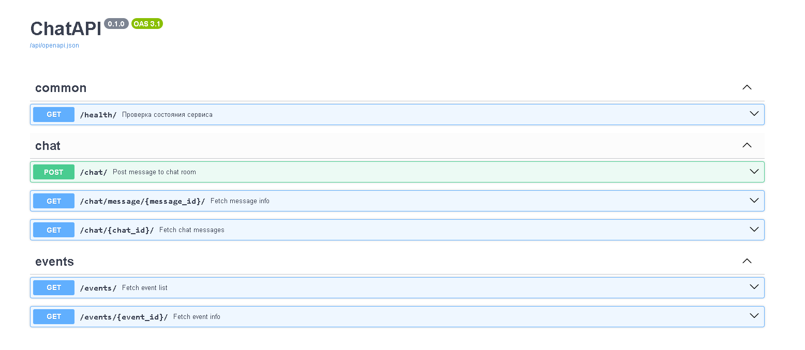

# FastAPI + FastStream + RabbitMQ чат

Чат на вебсокетах и событийной системе

# Настройка и запуск

## Настройка

Перед работой приложения нужно настроить переменные окружения.

- Для локального запуска(приложение локально, rabbit в докере) - нужно:
  1. Скопировать `local.env` в `sciarticle_task/.env`
  2. `poetry install` - установить проект
  3. `poetry shell` - активировать виртуальное окружение
- Для запуска в докере - скопировать `docker.env` в `docker-compose/.env`

## Запуск

1. Запустить rabbit через докер. `make storages`
2. Запустить приложение
   1. Докер - `make app`
   2. Локально - `make app-local`
3. Закрыть приложение `make down-all`

# Эксплуатация и проверка работоспособности

Если следовать инструкции, то на локальном хосте должен открыться порт 8000.

Swagger находится на `http://127.0.0.1:8000/api/openapi`.

Подключение к вебсокету из консоли, используя утилиту `websocat`: `websocat ws://127.0.0.1:8000/ws/updates/<Номер комнаты:int>`

# Ремарка по поводу ТЗ

> Ремарка 1:  сообщения приходят только в комнату, где может состоять только 2 юзера

Не понял требования, поэтому не стал реализовывать функционал.
Необходимо разъяснить бизнес-требования:
1. Все комнаты должны содержать исключительно два человека?
2. Комнаты нужно создавать?
3. А нужно ли их удалять?
4. Если нужно удалять, то в какой момент? Если из комнаты вышли все люди, либо же вручную? Для обоих вариантов реализованы репозитории.
5. Не отправлять в каналы с одним человеком, чтобы не тратить ресурсы?

В зависимости от ответа будет разная реализация.
- 1 - Если комнаты содержат максимум два человека, то необходим дополнительный Query. В зависимости от количества участником сразу выдаст ошибку либо подключит.
- 2 - Дополнительный endpoint
- 3, 4 - Если удалять вручную, то новый endpoint. Если при условии, что комната пуста, необходима дополнительная команда и запрос, которые будут срабатывать при выходе участников из комнаты.
- 5 - Если дело в экономии ресурсов, тогда т.к. бизнес-логики здесь быть не может, можно добавить дополнительные условия в infra/WebsocketConnectionManager

# Архитектура

Приложение построено на событийной системе, использующий паттерн "Посредник"(Mediator)

Ключевые составляющие Mediator:
1. Command, CommandHandler - команды и обработчики для команд. Предполагается, что их активирует пользователь.
2. Event, EventHandler - события и обработчики для событий. События могут вызываться из любого места. Вызываются из любого места, в том числе от выполнения пользовательской команды.

Кроме того, приложение также выстроено по DDD:
1. Доменная область - `domain`. В ней определены основные сущности, ошибки, события.
2. Инфрастуктура - `infra`. В нем определена логика взаимодействия с внешними системами: websockets, репозитории
3. Логика - `logic`. В нем содержится вся основная бизнес-логика: mediator, user-cases, serializer.
4. Представления - `application`. В нем содержится, соответственно, вся логика работы с пользователем: FastAPI и FastStream
5. DI контейнер - `container.py`.

## Плюсы и минусы архитектуры

Плюсы:
- Отдельные компоненты не имеют сильной связи друг с другом.
- С одной командой может быть связано несколько событий.

Минусы:
- Тяжело разобраться структуре.

# Стек

1. Python3
2. FastAPI
3. FastStream
4. RabbitMQ
5. DependencyInjector
6. Docker, docker-compose
7. poetry
8. ruff, mypy, pre-commit
9. structlog

# Структура отправки сообщения

# Скриншоты

